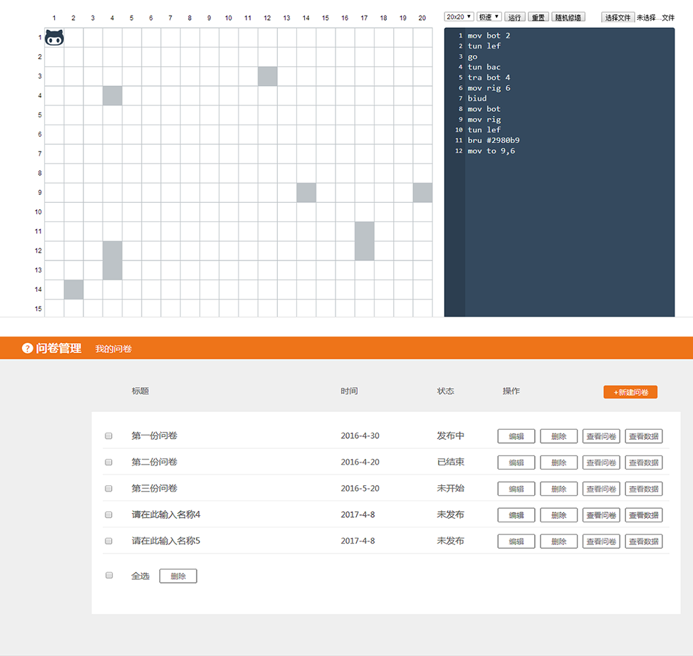

百度IFE2016任务
--------------------------------------------------------------------------------
&nbsp;&nbsp;&nbsp;&nbsp;&nbsp;&nbsp;&nbsp;&nbsp;**百度Web前端技术学院**（Baidu Institute of Front-End Technology简称IFE）是一个由百度人力资源部校园招聘组、百度EFE团队联合出品的、面向在校大学生以及对前端技术有兴趣的前端在线学习平台，我们希望能够借助百度大量优秀的前端工程师以及丰富的前端知识积累，帮助人们更加有趣、高效、系统地学习Web前端技术。[2016春季课题](http://ife.baidu.com/2016/task/all)

#### 相关截图
听指令的方块游戏和微型调查问卷系统

#### 项目总结

  **通过IFE一系列渐进课题加强了html,css,js的知识，系统全面的巩固了Web前端技术。边做边看一些书籍使自己关于web前端的技术得到提升**
 
* css布局，盒模型，定位，浮动相关问题，浏览器兼容，css3动画、过渡，自适应，移动端。
* js数据结构，控制流程语句，闭包,this指向，事件对象，事件冒泡、捕获，DOM事件、BOM对象接口,JS异步、js作用域，面向对象编程，AMD和CMD前端模块化。
* HTML语义化标签，书写合乎语义的HTML标签结构,利于维护阅读同时也方便搜索引擎的抓取。

